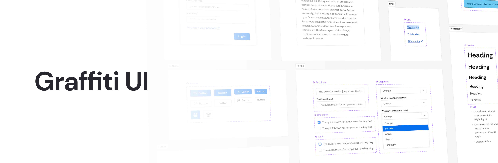

# Graffiti UI

> [!NOTE]
> Graffiti is a work-in-progress and a stable version has not yet been released.

Graffiti is a UI component library implemented in React with TypeScript. It's designed to be simple and customisable for use in UIs with various colour schemes and aesthetics.

## Table of contents

- 📃 [Documentation](#documentation)
- 📘 [Storybook](https://samhynds.github.io/graffiti-ui/)
- 🚀 [Features](#features)
- 💾 [Installation](#installation)
- 🤔 [Usage](#usage)
- ⚖️ [License](#license)

## Documentation

## Features

## Installation

```bash
# With npm
npm install @samgl/graffiti-ui

# With yarn
yarn add @samgl/graffiti-ui
```

## Usage

## License
